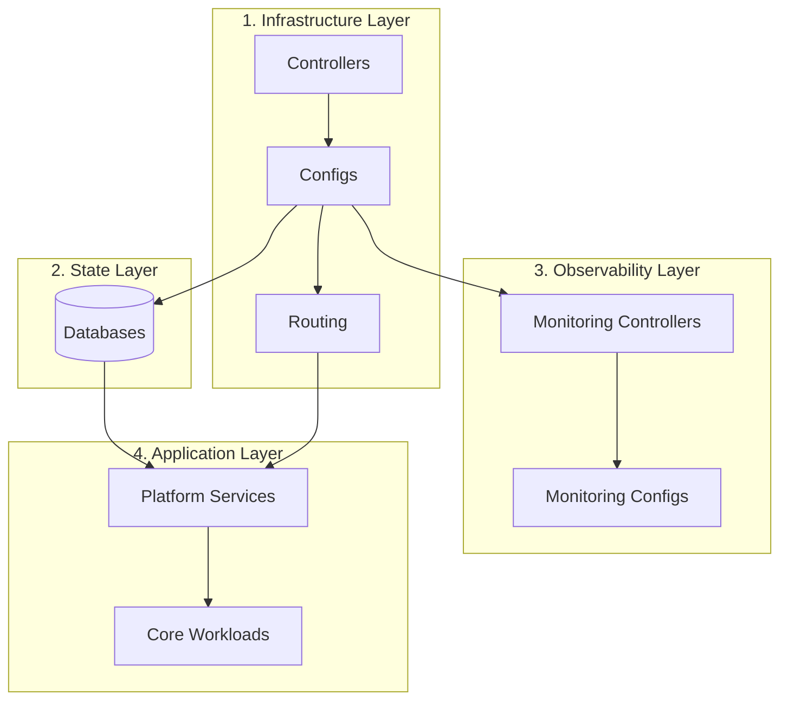

# 🏡 Homelab

## Introduction

This repository contains the configuration and documentation of my homelab environment.

The primary goal of this homelab is both educational and recreational. Lately, I’ve been exploring Kubernetes, and there’s no better way to learn than by running a cluster at home.
Additionally, self-hosting applications allows me to take full ownership of the deployment and maintenance process from start to finish.

## ⚙️ Operation System


I decided to use [Talos Linux](https://github.com/siderolabs/talos) to set up my machines.
Talos is a Linux distribution purpose-built for running Kubernetes.
It’s lightweight, efficient, and relatively easy to set up for home lab environments making it ideal for my needs.

## 🖥️ Hardware

I use a refurbished second-hand mini pc. They're great because they are small and cheap to buy.

- HP ProDesk 400 G4 i5-8500T/8GB/256GB M.2
- Lenovo ThinkCentre M70q i5-10500T/24GB/256GB M.2
- Lenovo ThinkCentre M70q i5-10500T/24GB/120GB SSD

## 📁 Project Structure

This project is organized into 4 primary domains:

- Applications:Shared platform services and end-user applications.
- Databases: Database and state management resources.
- Infrastructure: Core cluster resources, network routing, and system controllers.
- Monitoring: Observability tools, metrics collection, alert rules, and dashboards.

```bash
├── apps
│   ├── platform    # Shared platform services (e.g., Authelia)
│   └── workloads   # Core business application services
├── databases
├── clusters        # FluxCD bootstrap manifest
├── infrastructure  # Low-level cluster resource
│   ├── configs
│   └── controllers
└── monitoring      # Observability stack
    ├── configs
    └── controllers
```

## 🔄 FluxCD Dependency Apply Order

The diagram below illustrates the mandatory boot-sequence order (`dependsOn`) for manifests in this repository to prevent race conditions during cluster deployment.



## 🔐 Secret Management

<div style="display: flex; gap: 10px">
    
    
</div>

I decided to use [Azure Key Vault](https://azure.microsoft.com/en-us/products/key-vault) and inject them into cluster with [External Secrets Operator](https://external-secrets.io/).

**Why use a cloud secret provider instead of self-hosted?**

- This approach improves reliability, resilience, and simplifies maintenance
- In a GitOps setup (using FluxCD), `dependsOn` only ensures resources are applied, not that they are fully initialized or ready to use
- Secret managers may exist in the cluster but still be unavailable when dependent services start
- A self-hosted secret manager can become a single point of failure
- If the secret manager is unavailable, dependent services may fail to start or restart
- Cloud secret providers decouple secret management from the cluster

## 🌐 Service Exposing

### Publicly

<div style="display: flex; gap: 10px; align-items: center">
    
    
</div>

I use a [Cloudflare Tunnel](https://developers.cloudflare.com/cloudflare-one/connections/connect-networks/) integrated with [Cloudflare Zero Trust](https://developers.cloudflare.com/cloudflare-one/) to expose services, instead of the more traditional Ingress + VPN setup.

**Why Cloudflare Tunnel?**

- I want to keep things simple and secure
- No need for public IP addresses, firewall rule, or complex ingress config
- Cluster is never directly exposed to the internet
- Only authorized users can access internal services
- Lightweight solution with minimal operational overhead

### Locally

<div style="display: flex; gap: 10px; align-items: center">
    
    
    
    
</div>

- Use [Cilium](https://docs.cilium.io/en/stable/network/servicemesh/ingress/) as the Kubernetes CNI
- Use [cert-manager](https://cert-manager.io/docs/) for TLS management
- Integrate cert-manager with [Let’s Encrypt](https://letsencrypt.org/) for automated certificate provisioning
- Use [ExternalDNS](https://kubernetes-sigs.github.io/external-dns/) to propagate domain records to local IP
- Expose internal services via [Gateway API](https://kubernetes.io/docs/concepts/services-networking/gateway/), enforcing authentication per route using `ext_authz` filters integrated with Authelia

### Identity Provider (IdP)

<div style="display: flex; gap: 10px; align-items: center">
    
</div>

I use [Authelia](https://www.authelia.com/) as a central authentication and authorization server to manage identity and access control natively within the cluster.

**Why Self-hosted IdP?**

- **Local Service Authentication:** Many applications lack built-in authentication. A self-hosted IdP allows me to intercept traffic and enforce authentication directly at the Gateway level before requests reach the app.
- **Prevents Session Pollution:** External providers (like Google) tie cluster logins to global browser sessions, polluting main browsing profiles and interfering with personal services like Google Search.
- **Incognito-Friendly:** Since I heavily use incognito windows, relying on external IdPs creates endless re-authentication loops. A self-hosted IdP keeps session lifecycles simple, predictable, and isolated.
- **Centralized Identity:** Fully controls users, authentication policies, and app permissions in one place without depending on external cloud providers.

## 💾 Backup

<div style="display: flex; gap: 10px; align-items: center">
    
    
</div>

- I use [CloudNativePG (CNPG)](https://cloudnative-pg.io/), a Kubernetes-native operator for managing PostgreSQL clusters.
- It includes native support for backup and restore operations via object storage.
- Backups are stored in [Cloudflare R2](https://www.cloudflare.com/developer-platform/products/r2/).

## 🔭 Monitoring

I use the [kube-prometheus-stack](https://github.com/prometheus-community/helm-charts/tree/main/charts/kube-prometheus-stack), a comprehensive collection of manifests for deploying and managing Grafana and Prometheus.
