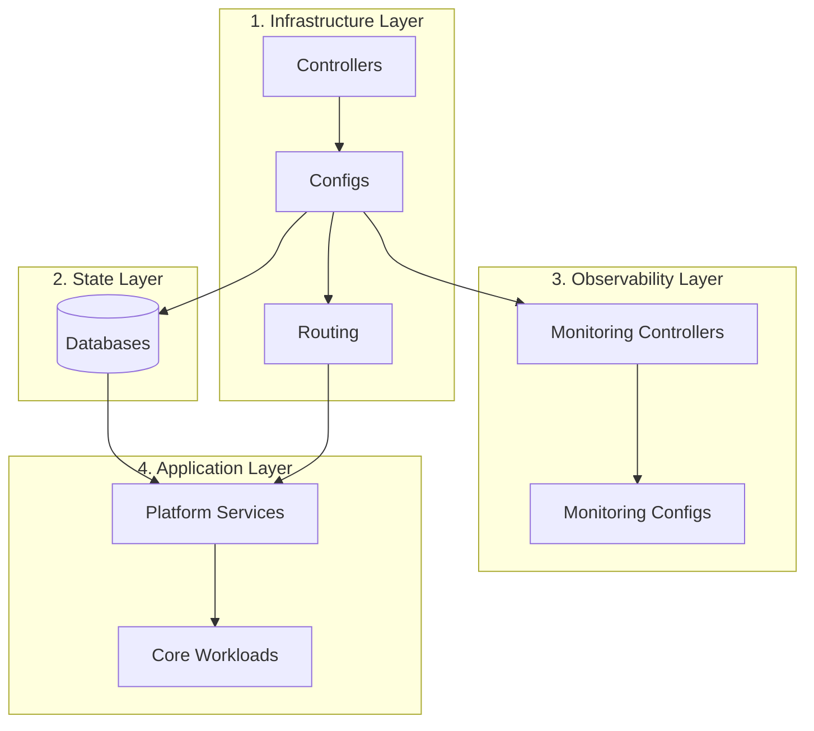
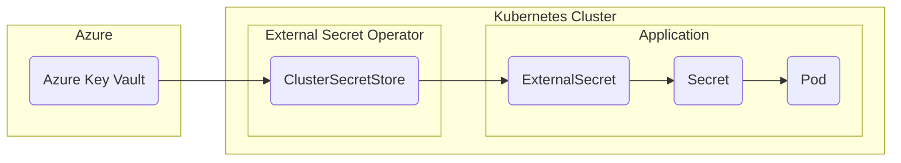
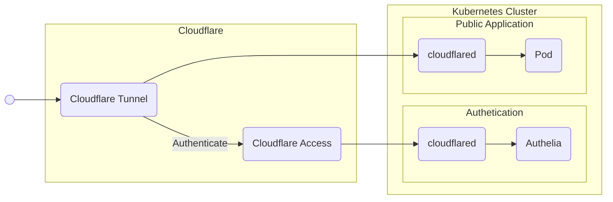
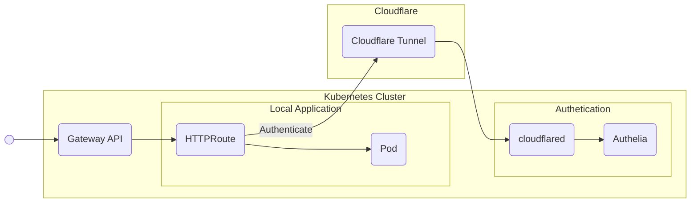
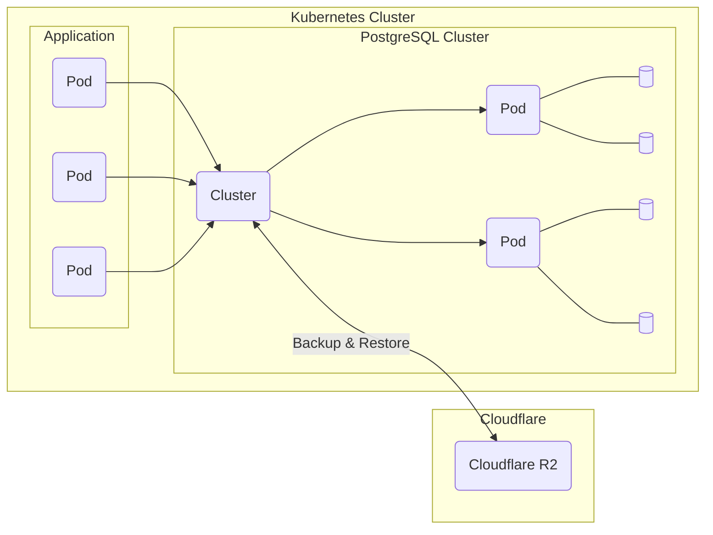
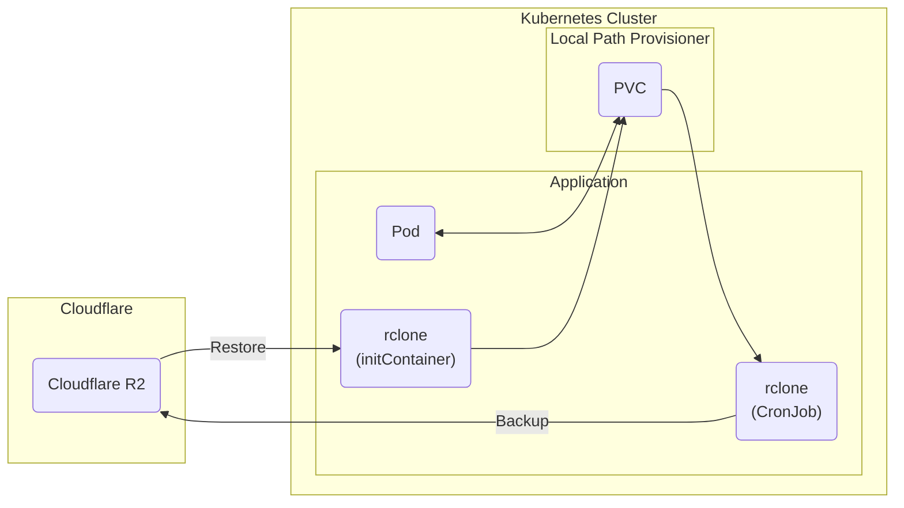

# 🏡 Homelab

## Introduction

This repository contains the configuration and documentation of my homelab environment.

The primary goal of this homelab is both educational and recreational. Lately, I’ve been exploring Kubernetes, and there’s no better way to learn than by running a cluster at home.
Additionally, self-hosting applications allows me to take full ownership of the deployment and maintenance process from start to finish.

## ⚙️ Operation System


I decided to use [Talos Linux](https://github.com/siderolabs/talos) to set up my machines.
Talos is a Linux distribution purpose-built for running Kubernetes.
It’s lightweight, efficient, and relatively easy to set up for home lab environments making it ideal for my needs.

## 🖥️ Hardware

I use a refurbished second-hand mini pc. They're great because they are small and cheap to buy.

- HP ProDesk 400 G4 i5-8500T/8GB/256GB M.2
- Lenovo ThinkCentre M70q i5-10500T/24GB/256GB M.2
- Lenovo ThinkCentre M70q i5-10500T/24GB/120GB SSD

## 📁 Project Structure

This project is organized into 4 primary domains:

- Applications:Shared platform services and end-user applications.
- Databases: Database and state management resources.
- Infrastructure: Core cluster resources, network routing, and system controllers.
- Monitoring: Observability tools, metrics collection, alert rules, and dashboards.

```bash
├── apps
│   ├── common      # Common manifests shared across multiple services
│   ├── platform    # Shared platform services (e.g., Authelia)
│   └── workloads   # Core business application services
├── databases
├── clusters        # FluxCD bootstrap manifest
├── infrastructure  # Low-level cluster resource
│   ├── configs
│   └── controllers
└── monitoring      # Observability stack
    ├── configs
    └── controllers
```

## 🔄 FluxCD Dependency Apply Order

The diagram below illustrates the mandatory boot-sequence order (`dependsOn`) for manifests in this repository to prevent race conditions during cluster deployment.


```mermaid
flowchart TD
    subgraph Infra["1. Infrastructure Layer"]
        ic["Controllers"]
        icf["Configs"]
        icr["Routing"]
    end

    subgraph Data["2. State Layer"]
        db[("Databases")]
    end

    subgraph Obs["3. Observability Layer"]
        mc["Monitoring Controllers"]
        mcf["Monitoring Configs"]
    end

    subgraph App["4. Application Layer"]
        ap["Platform Services"]
        aw["Core Workloads"]
    end

    %% Infrastructure dependencies
    ic --> icf
    icf --> icr

    %% Cross-domain dependencies
    icf --> db
    icf --> mc
    mc  --> mcf

    %% Application dependencies
    icr --> ap

    db  --> ap
    ap  --> aw
```

## 🔐 Secret Management


```mermaid
flowchart LR
    subgraph "Kubernetes Cluster"
        subgraph "External Secret Operator"
            cs("ClusterSecretStore")
        end
        subgraph "Application"
            cs --> es("ExternalSecret")
            es --> sec("Secret")
            sec --> pod("Pod")
        end
    end

    subgraph "Azure"
        kv("Azure Key Vault") --> cs
    end
```

I decided to use [Azure Key Vault](https://azure.microsoft.com/en-us/products/key-vault) and inject them into cluster with [External Secrets Operator](https://external-secrets.io/).

**Why not self-hosted?**

- Reliability, resilience, and simplifies maintenance
- FluxCD `dependsOn` ensures resources are applied, not ready, so secret managers may be unavailable when dependent services start.
- If it's is unavailable, dependent services may fail to start or restart
- It can become a single point of failure

## 🌐 Service Exposing

### Publicly


```mermaid
flowchart LR
    user((" "))

    subgraph "Cloudflare"
        tunnel("Cloudflare Tunnel") -->|Authenticate| access("Cloudflare Access")
    end

    user --> tunnel

    subgraph "Kubernetes Cluster"
        subgraph "Authetication"
            access --> cfd("cloudflared")
            cfd --> auth("Authelia")
        end
        subgraph "Public Application"
            tunnel --> cfd2("cloudflared")
            cfd2 --> serv("Pod")
        end
    end
```

I use a [Cloudflare Tunnel](https://developers.cloudflare.com/cloudflare-one/connections/connect-networks/) integrated with [Cloudflare Access](https://www.cloudflare.com/sase/products/access/) to expose services, instead of the more traditional Ingress + VPN setup.

- Simple and secure
- Cluster is never directly exposed to the internet
- Only authorized users can access internal services
- Lightweight solution with minimal operational overhead

### Locally


```mermaid
flowchart LR
    user2((" ")) --> gw("Gateway API")
    subgraph "Kubernetes Cluster"
        subgraph "Local Application"
            route("HTTPRoute") --> serv2("Pod")
        end
        subgraph "Authetication "
            cfd3("cloudflared") --> auth2("Authelia")
        end
        gw --> route
    end
    subgraph "Cloudflare "
        route -->|Authenticate| tunnel2("Cloudflare Tunnel")
        tunnel2 --> cfd3
    end
```

I use [Cilium](https://docs.cilium.io/en/stable/network/servicemesh/ingress/) which is a great Kubernetes CNI with support for the [Gateway API](https://kubernetes.io/docs/concepts/services-networking/gateway/):

- Expose internal services through the Gateway API
- Enforce per-route authentication using `ext_authz` on HTTPRoute with Authelia.

The Gateway API also integrates seamlessly with:

- [cert-manager](https://cert-manager.io/docs/) and [Let’s Encrypt](https://letsencrypt.org/) for automated TLS management
- [ExternalDNS](https://kubernetes-sigs.github.io/external-dns/) for propagating DNS records to local IP

### Identity Provider (IdP)

I use [Authelia](https://www.authelia.com/) to manage identity and access control natively within the cluster.

**Why self-hosted IdP?**

For simple use cases, using an external provider (such as Google) is an easy way to integrate with Cloudflare Access. However, for my use case:

- Many local exposed applications lack built-in authentication. With a self-hosted IdP and HTTPRoute, I can intercept incoming traffic and enforce authentication.
- I heavily use incognito windows, and relying on external identity providers will break the isolation and pollute my main browser sessions.
- Full control over users, policies, and per-application permissions without relying on features that may be limited or require additional costs from external providers.

## 💾 Backup

### Database


```mermaid
flowchart LR
    subgraph "Cloudflare"
        r2("Cloudflare R2")
    end

    subgraph "Kubernetes Cluster"
        subgraph "Application"
            pod1("Pod")
            pod2("Pod")
            pod3("Pod")
        end
        subgraph "PostgreSQL Cluster"

            lb("Cluster") --> pod4("Pod")
            lb("Cluster") --> pod5("Pod")
            pod4 --- db1[(" ")]
            pod4 --- db2[(" ")]
            pod5 --- db3[(" ")]
            pod5 --- db4[(" ")]
        end
        pod1 --> lb
        pod2 --> lb
        pod3 --> lb
    end

    lb <-->|Backup & Restore| r2
```

- I use [CloudNativePG (CNPG)](https://cloudnative-pg.io/), a Kubernetes-native operator for managing PostgreSQL clusters.
- It includes native support for backup and restore operations via object storage.
- Backups are stored in [Cloudflare R2](https://www.cloudflare.com/developer-platform/products/r2/).

### Persistent Storage


```mermaid
flowchart LR
    subgraph "Cloudflare"
        r2("Cloudflare R2")
    end

    subgraph "Kubernetes Cluster"
        subgraph "Local Path Provisioner"
            pvc("PVC")
        end
        subgraph "Application"
            pod("Pod") <--> pvc
            pvc --> cron("rclone<br/>(CronJob)")
            init("rclone<br/>(initContainer)") --> pvc
        end
    end

    r2 -->|Restore| init
    cron -->|Backup| r2
```

- I use [rclone](https://rclone.org/) with CronJob to periodically backup volume to Cloudflare R2.
- I use an `initContainer` checks the local storage on startup and syncs down from R2 before the app spins up.

## 🔭 Monitoring

I use the [kube-prometheus-stack](https://github.com/prometheus-community/helm-charts/tree/main/charts/kube-prometheus-stack), a comprehensive collection of manifests for deploying and managing Grafana and Prometheus.
